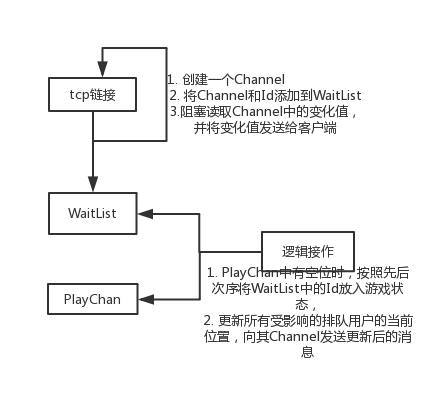

# 排队系统

## 1. 功能
	1. 排队的用户能实时看到自己当前所处的位置，一旦排到马上进入游戏状态
	2. 正在排队的用户退出，能够更新所有排队用户的当前位置
	3. 正在游戏的用户退出，能够更新所有排队用户当前位置
	4. 开发人员能够实时看到现在游戏中的用户数和正在排队中的用户数
	
## 2. 实现
一个客户端，一个服务端，之间通过TCP长链接通信。

每个用户都有一个32字节长的GUID做为唯一标识。

定义一个简单的通信协议：

	客户端-->服务端协议：
	4字节(命令) + 32字节(id)
	命令： SHUT/QUIT/OPEN
	OPNE命令是客户端请求时发送，SHUT/QUIT客户端没有使用到。
	
	服务端-->客户端协议：
	4字节(当前排队位置)+1字节(当前状态)
	状态值为1表示排队中，2表示游戏中

### 2.1 服务端
使用Channel实现Goroutine之间的同步和通信。

主要通信模型为：

WaitList列表用于存储按照先后次序到达的用户。

WaitNumMap字典用于存储排队用户的当前位置。

对WaitList操作需要线性操作，所有需要对WaitList的操作都放在OperateWaitList()独立go程中。

对WaitList的操作需要向以下四个Channel中发送消息，线性操作：

	EnqueueChan    chan def.ClientInfo // 进入排队时发送
	QuitQueueChan  chan string         // 退出排队时发送
	QuitGameChan   chan struct{}       //  退出游戏时发送
	QuitChan       chan string         // 链接断开时发送

Go程ListenChanges()用于实时通知正在游戏人数和排队人数。

### 2.2 客户端
客户端在初始登陆时，生成该用户的GUID，向服务器发送一个OPEN命令请求。

然后不断从从服务器接收更新后的消息，并打印到控制台。

## 3. 使用
	thinkerchi/queue-system/app/server/server.go是服务端的入口文件， 执行：go run server.go
	thinkerchi/queue-system/app/server/server.ini用于配置最大同时在线游戏人数, ip, port

	thinkerchi/queue-system/app/client/client.go是客户端的入口文件, 执行：go run client.go
	thinkerchi/queue-system/app/client/client.ini用于配置服务端ip, port
	退出排队或游戏，ctrl + C

## 4. 测试

## 5. 改进